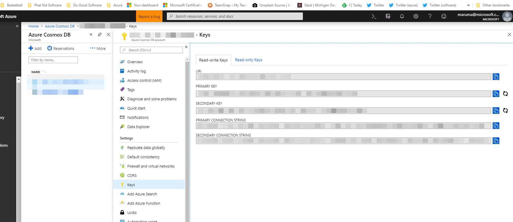

Run the following in the azure cli:

```
az group create --name RESOURCE_GROUP_NAME --location eastus2

az cosmosdb create --name COSMOS_DB_NAME --resource-group RESOURCE_GROUP_NAME

az cosmosdb database create --db-name root --url-connection COSMOS_URI --key COSMOS_KEY

az cosmosdb collection create --collection-name orders --db-name COSMOS_DB_NAME --partition-key-path "/team/id" --throughput 400 --url-connection COSMOS_URI --key COSMOS_KEY
```
Replace the variables with your naming convention for Azure resources.



Screenshot of where to find the COSMOS_URI and the COSMOS_KEY values.