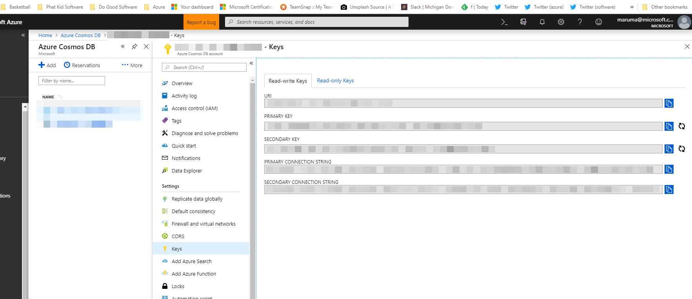

## Setup

### Azure

Run the following in the azure cli:

```
az group create --name RESOURCE_GROUP_NAME --location eastus2

az cosmosdb create --name COSMOS_DB_NAME --resource-group RESOURCE_GROUP_NAME

az cosmosdb database create --db-name root --url-connection COSMOS_URI --key COSMOS_KEY

az cosmosdb collection create --collection-name orders --db-name root --partition-key-path "/id" --throughput 400 --url-connection COSMOS_URI --key COSMOS_KEY
```
Replace the variables with your naming convention for Azure resources.



Screenshot of where to find the COSMOS_URI and the COSMOS_KEY values.

### Visual Studio Project

You will also need to update your `appsettings.json` file OR create an `appsettings.Development.json` file with the following settings:

```
{  
  "Azure": {
    "CosmosDB": {
      "DatabaseId": "COSMOS_DB_NAME",
      "Key": "COSMOS_KEY",
      "Endpoint": "COSMOS_URI"
    }
  }
}
```

### Postman

Scripts for testing the API can be imported into Postman from https://github.com/mattruma/CosmosDBWebApi/blob/master/CosmosDBWebApi%20API.postman_collection.json.

## Links

- Working with Azure Cosmos databases, containers and items https://docs.microsoft.com/en-us/azure/cosmos-db/databases-containers-items
- SQL Query Examples https://docs.microsoft.com/en-us/azure/cosmos-db/how-to-sql-query
- Modeling Data https://docs.microsoft.com/en-us/azure/cosmos-db/modeling-data
- Developing Locally https://docs.microsoft.com/en-us/azure/cosmos-db/local-emulator
- Partition Keys https://docs.microsoft.com/en-us/azure/cosmos-db/synthetic-partition-keys
- CosmosDB 3.0 SDK https://azure.microsoft.com/en-us/blog/azure-cosmos-dotnet-sdk-version-3-0-now-in-public-preview/.

## Training Resources

- https://docs.microsoft.com/en-us/learn/modules/access-data-with-cosmos-db-and-sql-api/
- https://docs.microsoft.com/en-us/learn/modules/build-cosmos-db-app-with-vscode/

## Examples 

- https://github.com/Azure-Samples/dotnet-cosmosdb-quickstart
- https://github.com/Azure-Samples/cosmos-dotnet-getting-started
- https://github.com/Azure-Samples/cosmos-dotnet-todo-app
- https://github.com/Azure-Samples/cosmos-dotnet-core-getting-started

The entire CosmosDB documentation can be found at https://docs.microsoft.com/en-us/azure/cosmos-db.
